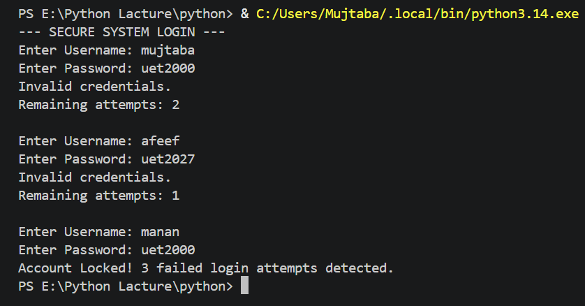
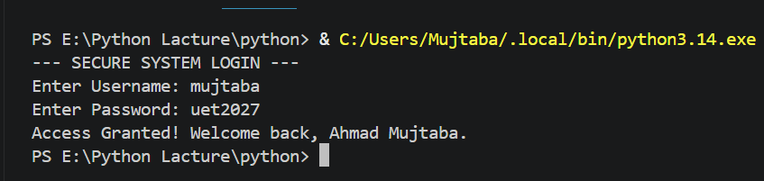

# Secure Login System

> A Python-based secure login simulation with account lockout after 3 failed attempts.

---

## About the Project

This project simulates a **real-world secure system login** with brute-force protection. Built right after completing the **Loops chapter** in Python — this is my first project applying `while` loop concepts to a real-world cybersecurity scenario.

> # This project was built right after completing the Loops chapter in Python.

---

## Topics Covered in This Project

- `while` loop
- `break`
- Attempt counter logic
- Boolean condition in loop
- Input handling inside loop

---

## Security Features

- Maximum **3 login attempts** allowed
- Account **locks automatically** after 3 failures
- Remaining attempts displayed after each wrong entry
- Case-sensitive credential validation

---

## How It Works

| Scenario | Output |
|----------|--------|
| Correct username & password | Access Granted — Welcome message displayed |
| Wrong credentials | Invalid credentials + Remaining attempts shown |
| 3 consecutive failures | Account Locked automatically |

---

## Sample Output

**Output 1** — 3 wrong attempts → Account Locked

**Output 2** — Correct credentials entered → Access Granted

---

## How to Run

1. Make sure Python is installed on your system
2. Clone this repository:
   `git clone https://github.com/ahmad-mujtaba648/secure-login-system.git`
3. Run the file:
   `python secure_login.py`

---

## Concepts Practiced

| Concept | Usage in Project |
|---------|-----------------|
| `while` loop | Runs login prompt until attempts run out |
| `break` | Exits loop immediately on successful login |
| Attempt counter | Tracks and displays remaining attempts |
| Boolean condition | Controls loop flow cleanly |
| Input inside loop | Re-asks credentials on every attempt |

---

## Challenges Faced & Lessons Learned

| Challenge | What I Learned |
|-----------|----------------|
| Taking input again inside loop | Input must be inside the loop to re-ask every attempt |
| `attempts >= 0` vs `attempts > 0` | Off-by-one error — always use `> 0` |
| When to use `break` vs condition | Use `break` when success is met, not just condition |
| Loop update inside loop | Always update counter/variable inside the loop |

---

## Tech Stack

---

## Author

**Ahmad Mujtaba**

CS Student @ UET Lahore | Aspiring Cybersecurity & AI Engineer

